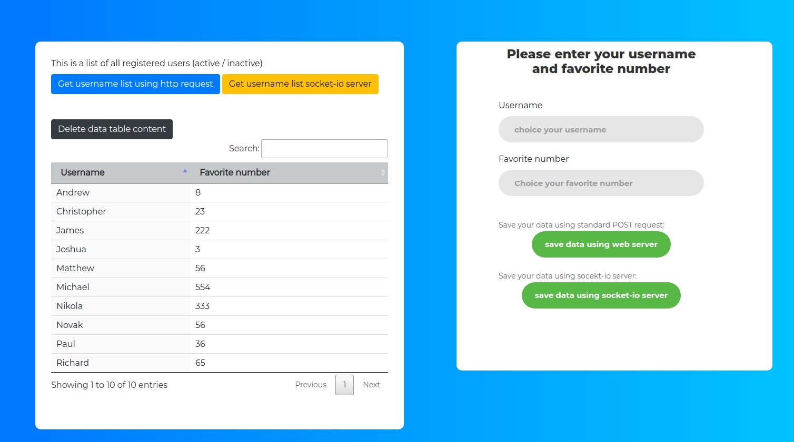

# README # 

### Basic Flask socket-io app ###

* `Flask-SocketIO` gives Flask applications access to low latency bi-directional communications between the clients and the server. The client-side application can use any of the SocketIO official clients libraries in Javascript, C++, Java and Swift, or any compatible client to establish a permanent connection to the server.
* The asynchronous services that this package relies on can be selected among three choices:

 * `eventlet` is the best performant option, with support for long-polling and WebSocket transports.
 * `gevent` is supported in a number of different configurations. 
 
 * When using `SocketIO`, messages are received by both parties as events. On the client side Javascript callbacks are used. With Flask-SocketIO the server needs to register handlers for these events, similarly to how routes are handled by view functions.
 * Another very useful feature of SocketIO is the broadcasting of messages. Flask-SocketIO supports this feature with the broadcast=True optional argument to `send()` and `emit()`. 
 
 * An alternative to socketio.run(app) is to use gunicorn as web server, using the eventlet or gevent workers.
 
 
### This basic app use: ###
`js socket-io client` `Flask` `Flask socket-io` `gunicorn` `eventlet` `redis` `DataTables`


## Quickstart (Docker)
Note: You'll need to have `docker` and `docker-compose` installed.
```
docker-compose up -d -> start app 
docker-compose down -> stop app
```
* Check that the UI is running by navigating to `localhost:5000`.
* Run services in the background by using `docker-compose up -d` (detached).
* Tail the logs by using `docker-compose logs -f`.
* Restart individual services by running `docker-compose restart <service_name>`

**Note:** There is example for configure redis in `app/main/settings_template.py` 
```
You can set your redis & port in app/main/settings.py if you running app without docker, 
but please see Dockerfile & docker-compose.yml ... 

```

**Note:** If you get a "version unsupported" error, you need to upgrade `docker-compose`:
```
sudo rm /usr/bin/docker-compose
sudo curl -L https://github.com/docker/compose/releases/download/1.11.1/docker-compose-`uname -s`-`uname -m` > /usr/local/bin/docker-compose
sudo chmod +x /usr/local/bin/docker-compose
```
* Run app without docker:

```
mkvirtualenv --python=/usr/bin/python3.7 name_of_your_env
pip3 install -r requirements.txt
```
**Note:** only one worker is suported via gunicorn & eventlet
```
gunicorn run_socket_app:app --worker-class eventlet -w 1 --bind localhost:5000 --reload
```
### This basic app structure: ###
1. the web layer, accepting and handling websocket connections
2. the broker and data store layer, implemented by Redis
3. the worker layer, handling the request messages and generating the responses

* When layer 1 receives a request, it should forward it to layer 3 over layer 2. Layer 3 should respond over layer 2. Layers 1 and 3 should never communicate directly. Each layer should be viewed as a separate component.


After running the above steps the following services should be RUNNING in :
- `ui`  --> User interface (port 5000)
- `flask socket-io server` handle socket io client message
- `worker` --> gunicorn eventlet worker processing client request and make response  
- `redis` --> Redis server (Store user input data)

**Note:**  This application handles 2 scenario (standard http reqest & socekt-io):

```

1) Standard HTTP POST request-> when user send data through html form on submit (on backend side there is endpoint that handle POST request and save data into redis)
2) Standard HTTP GET request -> when user click button for refresh data in table( on backend side there is endpoint that handle request & return data from redis)

The cmost important part:

3) js socket-io client send data submitted through html form -> on backend side there is Socket-io server which save data into redis and make broadcast message for all connected users
4) js socket-io client send request for new data through -> on backend side there is Socket-io server handle this request then server fetch data from redis and make reponse
 
```

* You can delete html data table (bot only from your browser, not from redis) & then you can click on 2 available button for fetch new data from server
(socket io server or standard http request for web server, please note there is two option for fetching data)
This feature is useful when you want to test fetching data from redis over this two solutions!


